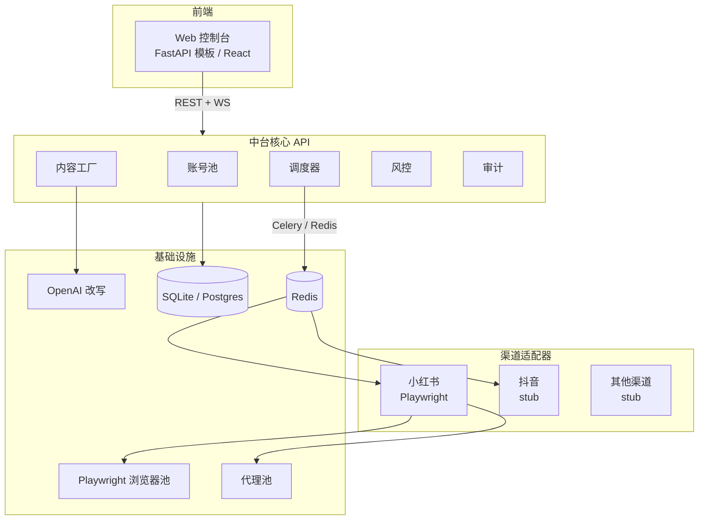
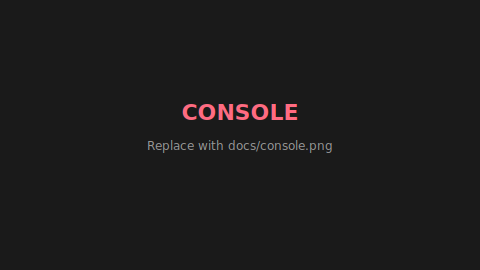
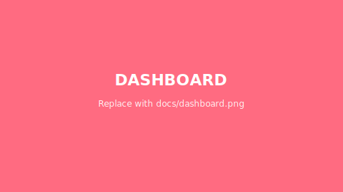
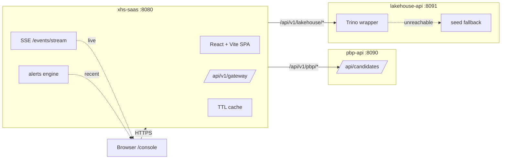

<!-- ============================================================ -->
<!-- xiaohongshu-Loop · 仓库首页                                  -->
<!-- 替换为真实品牌 LOGO 后，请同步更新顶部 hero 图和 favicon      -->
<!-- ============================================================ -->

<p align="center">
  
</p>

<h1 align="center">
  <sub>小红书起步 · 多渠道社媒 SaaS 中台</sub><br/>
  xiaohongshu-Loop
</h1>

<p align="center">
  <em>账号池 · 内容工厂 · 调度器 · 风控 · 渠道适配器 —— 五层解耦，一次接入，多渠道复用。</em>
</p>

<p align="center">
  <!-- 动态徽章（shields.io 实时拉取） -->
  <a href="https://github.com/zhenyu666-debug/xiaohongshu-Loop/stargazers"></a>
  <a href="https://github.com/zhenyu666-debug/xiaohongshu-Loop/network/members"></a>
  <a href="https://github.com/zhenyu666-debug/xiaohongshu-Loop/issues"></a>
  <a href="https://github.com/zhenyu666-debug/xiaohongshu-Loop/actions"></a>
  <a href="https://github.com/zhenyu666-debug/xiaohongshu-Loop/actions"></a>
  <a href="https://github.com/zhenyu666-debug/xiaohongshu-Loop/blob/main/LICENSE"></a>
  <a href="https://www.python.org/"></a>
</p>

<p align="center">
  <a href="#-快速开始">快速开始</a> · <a href="#-架构">架构</a> · <a href="#-自动修复测试-agent-loop">🤖 auto-fix</a> · <a href="#-demo">Demo</a> · <a href="xiaohongshu-saas/README.md">子项目文档</a>
</p>

---

<!-- ============================================================ -->
<!-- xiaohongshu-Loop · 架构预览                              -->
<!-- ============================================================ -->

<p align="center">
  
</p>

---

> [!IMPORTANT]
> **首发渠道：小红书** · 架构预留抖音 / 快手 / 视频号 / B 站 / 知乎扩展位 · **中台骨架优先**，业务侧只关心"什么账号发什么内容什么时间发"。

## 核心能力矩阵

| 模块 | 能力 | 状态 |
|---|---|---|
| **账号池** | 多账号分组 · 阶段化（新号 / 冷启 / 正常 / 限流） · cookie 持久化与轮换 | 已上线 |
| **内容工厂** | 模板生成 · 占位符替换 (`{emoji}` / `{hour}`) · 可选 OpenAI 改写 | 已上线 |
| **调度器** | APScheduler 周期任务 · 间隔 + 抖动 · 时间窗口 · 失败冷却 | 已上线 |
| **风控** | 日 / 小时配额 · 人类化随机延迟 · 暖机期 · 代理轮换 | 已上线 |
| **渠道适配器** | 小红书（Playwright，图文 / 视频 / 话题 / @ / 位置） | 已上线 |
| **渠道适配器** | 抖音 / 快手 / 视频号 / B 站 / 知乎 | 占位（stub） |
| **控制台** | FastAPI 模板版 + React/Vite 完整版（`/console`） | 双版本 |
| **观测** | 结构化日志 · `/metrics` Prometheus · `/api/dashboard/summary` | 已上线 |
| **部署** | `docker compose up` 一键拉起 Web + Worker + Redis + Postgres | 已上线 |

## 架构



## Demo

> [!TIP]
> **真实截图 / GIF 替换占位**：把下面的占位图替换为 `docs/demo-loop.gif` / `docs/console.png` / `docs/dashboard.png`，GitHub 会自动渲染。

<!-- 替换占位：推荐尺寸 1280x720，文件 < 10 MB -->
<p align="center">
  
  <br/><sub><em>↑ 把 <code>docs/demo-loop.gif</code> 拖到仓库根，替换此占位图</em></sub>
</p>

<p align="center">
  
  
</p>

## 🤖 自动修复测试 (agent loop)

> **凌晨 CI 红了 1-2 处，但你已经躺平** —— 让 Claude agent 自动读失败、做最小修复、再跑测试，直到绿或预算烧光。改完后**直接 push 到 main**。

### 触发闭环

```
PR merge → xhs-saas-ci runs → CI 失败
                ↓
        workflow_run 触发 auto-fix (auto-fix.yml)
                ↓
   ┌─ infinite-loop guard → 已是 auto-fix commit? → 放弃
   ├─ 10 轮: agent 修测试 (claude -p + pytest, $5/轮)
   ├─ inspect: 路径白名单 + diff ≤ 1000 行
   ├─ push → main
   ├─ 等二次 CI (12 min polling)
   │     ├─ success ✓ → 留
   │     └─ failure ✗ → 自动 revert
   └─ 失败: agent 日志上传 artifact
```

### 五层纵深防御

| 层 | 机制 |
|---|---|
| 1 | **paths 过滤** — agent 只能改 `xiaohongshu-saas/**` |
| 2 | **diff ≤ 1000 行** — 防止顺手大改 |
| 3 | **二次 CI** — push 后自动再跑，失败就自动 revert |
| 4 | **concurrency 串行** — 同分支同时只跑一个 |
| 5 | **infinite-loop guard** — HEAD 含 `auto-fix` 字样就放弃 |

### 启用 (一次性)

**1. 配 secret**: `仓库 settings → Secrets and variables → Actions → New repository secret`

```
Name:  ANTHROPIC_API_KEY
Value: <your-key>      # https://console.anthropic.com/keys
```

**2. 启用 branch protection** (推荐): `仓库 settings → Branches → main → Add rule`

- ☑ Require status checks to pass before merging
  - 必选: `lint-and-test` (xhs-saas-ci 的 job)
- ☑ Do not allow bypassing the above settings

**3. 验证安装**:

```bash
# 本地试跑一遍 (CI 不会触发, 仅本地模拟)
cd xiaohongshu-saas
MAX_ITER=3 BUDGET=2 bash ../scripts/auto-fix-tests.sh

# 看 .github/workflows/auto-fix.yml 详情
cat .github/workflows/auto-fix.yml
```

### 紧急停止

auto-fix 失控时（agent 反复改同一文件、budget 烧光、infinite loop）：

| 方式 | 命令 |
|---|---|
| **A. UI 取消** | `Settings → Actions → 找到该 run → Cancel workflow` |
| **B. 关触发** | 在 `.github/workflows/auto-fix.yml` 注释掉整个 `on:` 块, push |
| **C. 打破循环** | push 任意一个**不含 "auto-fix"** 的 commit，打破 guard 检测 |
| **D. 改回旧 SHA** | `git revert HEAD && git push`（CI 会反向验证） |

详见 [`docs/auto-fix-tests.md`](docs/auto-fix-tests.md)。

---

## 快速开始

> [!NOTE]
> 详细文档见 [`xiaohongshu-saas/README.md`](xiaohongshu-saas/README.md)。下面给出 3 种主流启动方式。

### 方式 A：Docker 一键起（推荐）

```bash
git clone https://github.com/zhenyu666-debug/xiaohongshu-Loop.git
cd xiaohongshu-Loop/xiaohongshu-saas/deploy
docker compose up -d
# Web:        http://localhost:8080
# Prometheus: http://localhost:9090
```

### 方式 B：本地开发

```bash
cd xiaohongshu-saas
python -m venv .venv && source .venv/bin/activate   # Windows: .venv\Scripts\activate
pip install -e ".[dev,ai]"
playwright install chromium

cp .env.example .env       # 填 OPENAI_API_KEY（可选）
python -m scripts.init_db
uvicorn app.main:app --reload --port 8080
```

### 方式 C：React 控制台（完整后台）

```bash
cd xiaohongshu-saas/web/console
npm install
npm run dev     # 开发模式 http://localhost:5173/console/
npm run build   # 打包到 dist/
```

Vite 已配置代理，开发时 `/api` 请求自动转发到 `http://localhost:8080`。

## 渠道适配器扩展

每个渠道只需实现 [基础协议](xiaohongshu-saas/app/channels/base.py)：

```python
class ChannelAdapter(Protocol):
    name: str
    async def login(self, account: Account) -> None: ...
    async def publish(self, account: Account, content: ContentItem) -> PublishResult: ...
    async def heartbeat(self, account: Account) -> AccountHealth: ...
```

注册到中台即可：

```python
# xiaohongshu-saas/app/channels/registry.py
register(XiaohongshuAdapter())
# register(DouyinAdapter())
# register(KuaishouAdapter())
```

## 风控默认策略

| 策略 | 默认值 | 配置项 |
|---|---|---|
| 单账号日发帖上限 | 5 | `DAILY_POST_LIMIT_PER_ACCOUNT` |
| 单账号小时发帖上限 | 2 | `HOURLY_POST_LIMIT_PER_ACCOUNT` |
| 失败冷却 | 30 分钟 | `COOL_DOWN_MINUTES_AFTER_FAIL` |
| 人类化随机延迟 | 1.2 – 4.5 秒 | `HUMAN_DELAY_MIN_MS` / `_MAX_MS` |
| 代理轮换间隔 | 每 20 条 | `PROXY_ROTATE_EVERY` |
| 新号独立发帖前暖机时长 | 24 小时 | `WARMUP_HOURS_BEFORE_SOLOPOST` |

> [!WARNING]
> 强烈建议：账号数量 × 单号日上限 < 平台安全阈值 + 30% 冗余。

## Roadmap

- [x] 中台骨架（账号 / 内容 / 任务 / 风控）
- [x] 小红书适配器（Playwright + cookie 复用）
- [x] 内容工厂（模板 + OpenAI 改写）
- [x] Docker 一键起
- [x] 仓库根 README 装修（Hero + Badge + 架构图）
- [x] **CI 自动修复**（`auto-fix.yml` + `scripts/auto-fix-tests*.sh`，五层防御）
- [ ] 抖音 / 视频号适配器
- [ ] 多租户（团队 / 角色 / 计费）
- [ ] 移动端 H5 控制台
- [ ] 数据回流（曝光 / 互动 → 选题反哺）
- [ ] 真实 demo GIF + 控制台截图替换占位

## 相关工具与文档

- 🤖 **自动修复**: [`.github/workflows/auto-fix.yml`](.github/workflows/auto-fix.yml) + [`docs/auto-fix-tests.md`](docs/auto-fix-tests.md)
- 🐍 **Python loop**: [`scripts/auto-fix-tests.sh`](scripts/auto-fix-tests.sh)
- 📦 **npm loop**: [`scripts/auto-fix-tests-npm.sh`](scripts/auto-fix-tests-npm.sh)
- 🧪 **CI**: [`.github/workflows/xhs-saas-ci.yml`](.github/workflows/xhs-saas-ci.yml)

## Contributing

PR / Issue 欢迎：

- [贡献指南（占位）](CONTRIBUTING.md)
- [Issue 模板（占位）](.github/ISSUE_TEMPLATE.md)
- [行为准则（占位）](CODE_OF_CONDUCT.md)

本地开发流程：

```bash
cd xiaohongshu-saas
ruff check .
pytest -q tests
```

## Disclaimer

> 本项目仅用于**工程研究与自有账号自动化**，请：
> 1. 严格遵守各平台协议与机器人规范；
> 2. 不得用于刷量、灰产、虚假宣传等违规场景；
> 3. 因使用不当造成的封号、法律风险由使用者自行承担。

## License

[MIT](LICENSE) · 详见 [`LICENSE`](LICENSE) 文件。

## Unified Console · Tier-1（GUI 整合）

把 **xiaohongshu-saas**、**donor-screener-pbp**、**data-lakehouse** 三个真实模块整合到一个 Web 控制台里。

### 架构



### 启停（docker compose）

```bash
docker compose up -d --build
curl http://localhost:8080/api/healthz          # xhs-saas
curl http://localhost:8080/api/v1/health/all    # aggregate
open http://localhost:8080/console              # 控制台
docker compose down
```

### 端到端冒烟测试

```bash
pip install -r scripts/requirements-e2e.txt
python scripts/e2e_smoke.py
```

### GUI 页面

| 路径 | 描述 |
|------|------|
| `/console/` | Dashboard |
| `/console/accounts` | 账号管理 |
| `/console/tasks` | 定时任务 |
| `/console/candidates` | 候选列表（> 200 行自动虚拟化） |
| `/console/candidates/top20` | Top-20 + 分数分布直方图 |
| `/console/candidates/:id` | 候选详情 |
| `/console/analytics` | 数据 KPI 概览 |
| `/console/analytics/pv-uv` | PV/UV 时序（多指标切换） |
| `/console/analytics/funnel` | 转化漏斗 |
| `/console/analytics/top-items` | Top-N（CSV 导出） |
| `/console/alerts` | 告警中心（SSE 实时） |
| `/console/settings` | 设置 |

### 已实现的 milestones

- **M1**：Tailwind + shadcn + React Router + QueryClient + AppShell
- **M2**：Dashboard / Accounts / Tasks 三页 shadcn + dark mode
- **M3a**：donor-screener-pbp FastAPI（端口 8090，candidates API + tests）
- **M3b**：xhs-saas 上游 gateway + Candidates 列表/Top-20/详情 三页
- **M4a**：data-lakehouse FastAPI（端口 8091，Trino wrapper + seed fallback）
- **M4b**：Analytics 概览/PV-UV/漏斗/Top-N 四页
- **M5 backend**：SSE /events/stream、告警引擎（60s 滑窗）、TTL cache
- **M5 frontend**：useSSE / useVirtualizedList、AlertsCenter、Candidates 虚拟化 + CSV 导出
- **M6**：docker-compose 三服务编排 + e2e smoke + 架构图

### 测试统计

| 服务 | 测试数 |
|------|-------|
| xhs-saas backend | 39/39 |
| xhs-saas console frontend | 21/21 |
| pbp-api | 5/5 |
| lakehouse-api | 5/5 |
| **合计** | **70/70** |

### 端口汇总

| 端口 | 服务 |
|------|------|
| 8080 | xhs-saas（含 /console 控制台） |
| 8090 | pbp-api |
| 8091 | lakehouse-api |
| 8081 | (历史) iceberg-rest |

---

<p align="center">
  <sub>
    <a href="https://github.com/zhenyu666-debug/xiaohongshu-Loop/blob/main/xiaohongshu-saas/README.md">完整文档</a>
    · <a href="https://github.com/zhenyu666-debug/xiaohongshu-Loop/issues">反馈 Bug</a>
    · <a href="https://github.com/zhenyu666-debug/xiaohongshu-Loop/issues">提需求</a>
  </sub>
</p>


### Desktop Launcher (Windows .exe GUI)

The whole stack now ships as a **double-clickable Windows executable** that
launches a real GUI window (pywebview + WebView2, no Python install needed on
the target machine).  Stop the docker compose flow and just run this instead.

| Build output | Path |
|---|---|
| `dist/xhs-saas-console/xhs-saas-console.exe` | main launcher (~15 MB) |
| `dist/xhs-saas-console/_internal/` | bundled runtime + Uvicorn + deps (~85 MB) |

How to build it locally:

```bash
pip install pywebview pystray Pillow pyinstaller
python scripts/build_launcher.py
```

Then double-click `dist\xhs-saas-console\xhs-saas-console.exe` and a window
pops up: live status for the three services, big buttons (Start / Stop /
Open console / Quit) and a rolling log tail.  When all three are healthy the
console opens itself in your default browser at `http://127.0.0.1:8080/console/`.

Same launcher but from source (no build step):

```bash
pip install -r scripts/requirements-launcher.txt
python scripts/console_gui.py
```

Status / introspection port: `http://127.0.0.1:8765/status` (JSON snapshot,
useful for scripts and remote monitoring).

<!-- Star History: 替换 owner/repo 后自动生成 -->
<p align="center">
  
</p>