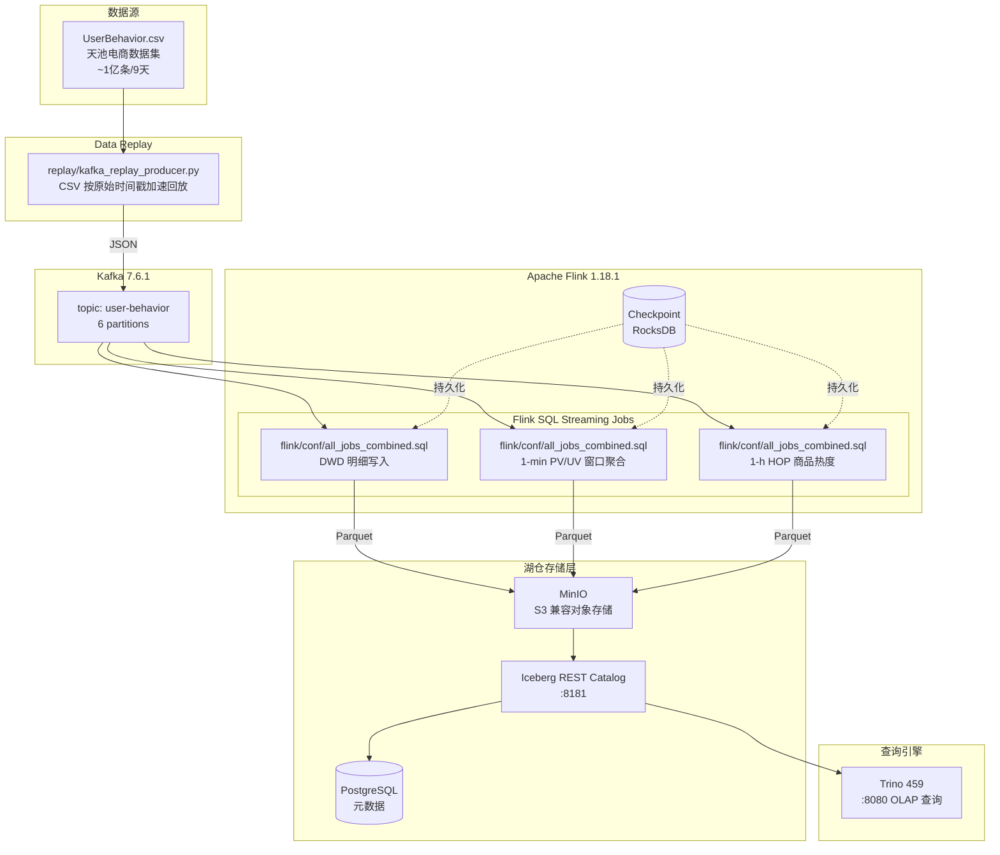

# 实时湖仓分析项目 (data-lakehouse630)

基于阿里云天池淘宝用户行为数据集，实现完整的**实时湖仓数据处理流水线**——Kafka → Flink Streaming → Iceberg (MinIO) → Trino OLAP 查询。

## 系统架构



## 技术栈

| 组件 | 版本 | 用途 |
|------|------|------|
| Apache Kafka | 7.6.1 | 实时消息队列 |
| Apache Flink | 1.18.1 | 实时流处理引擎 |
| Apache Iceberg | 1.5.2 | 湖仓存储格式 |
| MinIO | latest | S3 兼容对象存储 |
| Trino | 459 | OLAP 查询引擎 |
| PostgreSQL | 15 | Iceberg 元数据存储 |

## 快速启动（一键）

```powershell
# 在 data-lakehouse 目录下
.\scripts\startup.ps1

# 可选参数：
.\scripts\startup.ps1 -Speedup 3600    # 加速倍率，默认 86400（1秒=1天）
.\scripts\startup.ps1 -MaxDockerWait 300  # Docker 等待超时，默认 300s
```

`startup.ps1` 会自动完成：启动 Docker 容器 → 下载 Flink Iceberg JAR → 创建 Kafka topic → 安装 Python 依赖 → 灌入数据 → 提示启动 Flink SQL。

## 手动分步启动

### 1. 准备数据集

```bash
# 下载天池 UserBehavior.csv（约 3.4 GB）
# https://tianchi.aliyun.com/dataset/649
# 解压后放入 data/raw/UserBehavior.csv
```

### 2. 启动基础设施

```bash
docker compose up -d
docker compose ps
```

### 3. Kafka Topic

```bash
docker compose exec kafka kafka-topics.sh \
    --bootstrap-server localhost:9092 \
    --create --topic user-behavior \
    --partitions 6 --replication-factor 1
```

### 4. 数据回放

```bash
pip install kafka-python pandas psutil

# speedup=3600: 1秒=1小时数据（9天约3.75小时播完）
python replay/kafka_replay_producer.py \
    --input data/raw/UserBehavior.csv \
    --kafka localhost:9092 \
    --topic user-behavior \
    --speedup 3600 --batch-size 5000
```

### 5. Flink SQL 作业

```bash
docker compose exec flink-jobmanager bash -c "./bin/sql-client.sh"
```

在 SQL Client 中执行：

```sql
-- 一次性提交全部作业（DDL + 3个 INSERT streaming job）
SET 'execution.runtime-mode' = 'streaming';
SET 'execution.checkpointing.interval' = '30 s';
SET 'state.backend' = 'rocksdb';
:f /opt/flink/conf/all_jobs_combined.sql
```

## 目录结构

```
data-lakehouse/
├── docker-compose.yml         # 基础设施编排（Kafka/Flink/Trino/MinIO/Iceberg-REST）
├── README.md                  # 本文件
├── requirements.txt           # Python 依赖

├── scripts/
│   ├── startup.ps1            # Windows 一键启动脚本
│   ├── download-connectors.sh # 下载 Flink Iceberg Connector JAR
│   └── wait-for-it.sh         # 服务依赖等待脚本

├── flink/
│   ├── conf/
│   │   ├── all_jobs_combined.sql  # 全部作业（DDL + 3 INSERT）
│   │   ├── step1_ddl.sql          # DDL 单独版
│   │   ├── step2_inserts.sql      # INSERT 单独版
│   │   ├── flink-conf.yaml        # Flink 配置
│   │   └── catalogs.yaml          # Flink SQL Client catalogs
│   ├── jobs/                     # Flink SQL 作业（分步版）
│   │   ├── 01_kafka_source.sql
│   │   ├── 02_iceberg_sink.sql
│   │   ├── 03_etl_job.sql
│   │   └── 04_analytics.sql
│   └── sql/                     # 历史/实验 SQL
│       ├── pvuv.sql
│       ├── item_hot.sql
│       └── funnel.sql
├── trino/
│   ├── etc/
│   │   ├── config.properties
│   │   ├── jvm.config
│   │   ├── node.properties
│   │   └── catalog/iceberg.properties
│   └── queries/                 # OLAP 查询
│       ├── pv_uv.sql
│       ├── topn_items.sql
│       ├── funnel.sql
│       └── rfm_analysis.sql
├── replay/
│   ├── kafka_replay_producer.py     # 数据回放 Producer v1
│   ├── kafka_replay_producer_v2.py  # 数据回放 Producer v2（修复版）
│   └── download_dataset.py          # 数据集下载脚本
├── docs/
│   ├── ARCHITECTURE.md          # 架构设计文档
│   └── DATASET.md              # 数据集说明
└── data/
    ├── raw/                    # 原始数据（.gitignore）
    │   └── UserBehavior.csv
    └── generate_test_data.py   # 测试数据生成脚本
```

## 服务端口

| 服务 | 地址 | 凭证 |
|------|------|------|
| Flink Dashboard | http://localhost:8081 | - |
| Kafka UI | http://localhost:8083 | - |
| MinIO Console | http://localhost:9001 | admin / password |
| MinIO API | localhost:9000 | - |
| Trino Web UI | http://localhost:8080 | - |
| Iceberg REST | http://localhost:8181 | - |

## 核心表结构

### user_behavior_dwd（明细表，按天分区）

| 字段 | 类型 | 说明 |
|------|------|------|
| user_id | BIGINT | 用户 ID |
| item_id | BIGINT | 商品 ID |
| category_id | BIGINT | 类目 ID |
| behavior_type | STRING | pv/buy/cart/fav |
| event_time | TIMESTAMP(3) | 事件时间 |
| pt | STRING | 分区键 yyyy-MM-dd |

### user_behavior_pvuv_1m（分钟级聚合表）

| 字段 | 类型 | 说明 |
|------|------|------|
| window_start | TIMESTAMP(3) | 窗口开始 |
| window_end | TIMESTAMP(3) | 窗口结束 |
| pv | BIGINT | 页面浏览量 |
| uv | BIGINT | 独立访客数 |
| cart_count | BIGINT | 加购次数 |
| buy_count | BIGINT | 购买次数 |
| pt | STRING | 分区键 |

### item_hot_1h（小时级商品热度）

| 字段 | 类型 | 说明 |
|------|------|------|
| window_start | TIMESTAMP(3) | 窗口开始 |
| window_end | TIMESTAMP(3) | 窗口结束 |
| item_id | BIGINT | 商品 ID |
| pv | BIGINT | 点击量 |
| cart_count | BIGINT | 加购量 |
| buy_count | BIGINT | 成交量 |
| category_id | BIGINT | 类目 ID |
| pt | STRING | 分区键 |

## 分析场景

- **PV/UV 趋势**：按分钟聚合页面浏览和独立访客
- **商品 Top N**：热销商品排行（点击量/成交量）
- **转化漏斗**：pv → cart → buy 转化率分析
- **RFM 分析**：用户价值分层
- **会话分析**：用户行为序列模式

## Trino 查询示例

```sql
-- 查询最近 1 分钟 PV/UV
SELECT * FROM iceberg.lake.user_behavior_pvuv_1m
ORDER BY window_end DESC
LIMIT 10;

-- 商品热度 Top10
SELECT item_id, SUM(pv) AS total_pv, SUM(buy_count) AS total_buy
FROM iceberg.lake.item_hot_1h
WHERE pt = '2017-11-25'
GROUP BY item_id
ORDER BY total_pv DESC
LIMIT 10;
```

## 停止服务


```bash
docker compose down
```

## lakehouse-api (FastAPI 控制台后端)

`lakehouse_api/` 是一个轻量 FastAPI 服务（port 8091），把上述 Trino 查询
包装成 REST endpoint 供 xhs-saas 统一控制台读取。

### 启动

```bash
pip install -e .
uvicorn lakehouse_api.main:app --reload --port 8091
```

### 端点

| Method | Path | Notes |
|--------|------|-------|
| GET | `/healthz` | liveness |
| GET | `/api/kpis` | 今日 PV/UV/转化 |
| GET | `/api/funnel` | 4 阶段漏斗 |
| GET | `/api/series/{pv,uv,conversions}?days=14` | 时序 |
| GET | `/api/top-items?metric=pv&limit=10` | Top-N |

### 数据后端

- 设置环境变量 `TRINO_HOST=trino.example.com` `TRINO_PORT=8080` 后, 真实
  Trino 数据优先返回 (字段 `source: trino`).
- 未设置 / 不可达 → 回落到 `seed.py` 的合成数据 (字段 `source: seed`),
  保证 GUI 在本地开发期间始终有图可看.

### 测试

```bash
python -m pytest -q tests
```

5/5 tests cover health, kpis shape, three metrics time-series,
unknown-metric 422, and top-items ordering.

### 容器

```bash
docker build -t lakehouse-api .
docker run -p 8091:8091 -e TRINO_HOST=trino lakehouse-api
```
