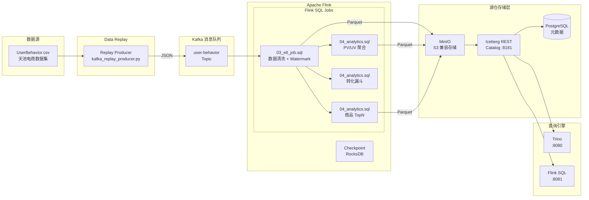

# 实时湖仓分析项目 — 架构设计

## 系统架构图



## 数据流向

```
CSV 文件 (3.4GB, ~1亿条)
    │
    ▼  kafka_replay_producer.py (按原始时间戳加速回放)
Kafka Topic: user-behavior
    │
    ▼  Flink ETL (Watermark + 清洗 + 去重)
Iceberg Table: user_behavior_dwd (Parquet, 按天分区)
    │
    ├─► Flink 窗口聚合 ─► user_behavior_pvuv_1m (分钟级指标)
    ├─► Flink 窗口聚合 ─► item_hot_1h (小时级商品热度)
    │
    ▼  Trino OLAP 查询
报表 / 数据分析
```

## 核心表结构

### user_behavior_dwd（明细表）

| 字段 | 类型 | 说明 |
|------|------|------|
| user_id | BIGINT | 用户 ID |
| item_id | BIGINT | 商品 ID |
| category_id | BIGINT | 类目 ID |
| behavior_type | STRING | 行为类型: pv/buy/cart/fav |
| event_time | TIMESTAMP | 事件时间 |
| pt | STRING | 分区键: 2027-11-25 |

### user_behavior_pvuv_1m（分钟聚合表）

| 字段 | 类型 | 说明 |
|------|------|------|
| window_start | TIMESTAMP | 窗口开始时间 |
| window_end | TIMESTAMP | 窗口结束时间 |
| pv | BIGINT | 页面浏览量 |
| uv | BIGINT | 独立访客数 |
| cart_count | BIGINT | 加购次数 |
| buy_count | BIGINT | 购买次数 |
| pt | STRING | 分区键 |

### item_hot_1h（小时商品热度表）

| 字段 | 类型 | 说明 |
|------|------|------|
| window_start | TIMESTAMP | 窗口开始 |
| window_end | TIMESTAMP | 窗口结束 |
| item_id | BIGINT | 商品 ID |
| pv | BIGINT | 点击量 |
| cart_count | BIGINT | 加购量 |
| buy_count | BIGINT | 成交量 |
| category_id | BIGINT | 类目 ID |
| pt | STRING | 分区键 |

## 关键技术要点

### Watermark 机制
- 使用 `event_time`（从 CSV `timestamp` 转换）作为事件时间
- Watermark 允许 5 分钟乱序容忍
- 数据回放场景下，乱序程度取决于 `--speedup` 加速倍率

### Iceberg 分区策略
- 采用天级分区（`pt = DATE_FORMAT(event_time, 'yyyy-MM-dd')`）
- 支持时间旅行：`SELECT * FROM table TIMESTAMP AS OF '...'`
- 支持版本回溯：`SELECT * FROM table VERSION AS OF 3`

### Flink Checkpoint
- **必须开启**，Iceberg Sink 依赖 Checkpoint 提交数据文件
- 间隔：30 秒
- 后端：RocksDB（支持大状态）
- 外部持久化：本地挂载卷

### 小文件问题
- Flink 持续写入会产生大量小 Parquet 文件
- 建议定期运行 `rewrite_data_files` 合并文件
- 可通过 `write.target-file-size-bytes` 控制文件大小

## 端口占用

| 服务 | 端口 | 访问地址 |
|------|------|----------|
| Kafka | 9092 | localhost:9092 |
| Kafka UI | 8083 | http://localhost:8083 |
| Flink Dashboard | 8081 | http://localhost:8081 |
| MinIO Console | 9001 | http://localhost:9001 (admin/password) |
| MinIO API | 9000 | localhost:9000 |
| Iceberg REST | 8181 | http://localhost:8181 |
| PostgreSQL | 5432 | localhost:5432 (admin/password) |
| Trino | 8080 | http://localhost:8080 |
