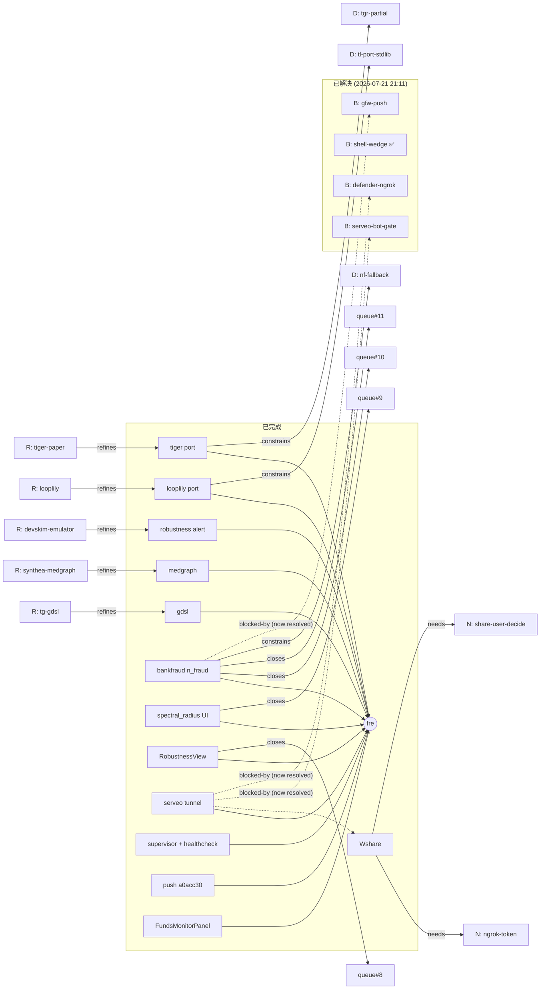

# Graph Chain — Tiger 记忆图（v1）

> **用途**：Tiger 的工作 / 计划 / 决议 / 阻塞 / 项目 之间的**节点关系图**。
> **格式**：节点 + 有向边 + 边类型；可机器解析（Mermaid block）也可人读。
> **互补**：`LOOP-STATETiger.md` 是按时间排序的日志（事实流），
>  本文件是按**关系**排序的索引（结构视图）—— 同一事实两边都有指针。
>
> **更新规则**：每条 `LOOP-STATETiger.md` 新日志落地的同时，在本文件追加 / 修改对应节点 / 边。
> 反向：`LOOP-STATETiger.md` 顶部会指向本文件。

---

## 0. 节点类型表

| 类型 | 前缀 | 含义 | 例子 |
|---|---|---|---|
| 项目 | `P` | 一个完整的项目 / 仓库 | `P:fre` = fraud-risk-engine |
| 工作 | `W` | 一次具体的开发 / 修改 | `W:nf` = n_fraud 参数化 |
| 计划 | `L` | `LOOP-STATE` Next-steps 队列的一条 | `L:queue#8` |
| 决议 | `D` | 做出的不可逆决策 | `D:tl-port-stdlib` |
| 阻塞 | `B` | 任何"我卡住"的状态 | `B:gfw-push` |
| NeedsMe | `N` | 需要用户决策的项 | `N:ngrok-token` |
| 资源 | `R` | 外部 / 内部资源 | `R:looplily` |

## 1. 边类型表

| 边 | 含义 |
|---|---|
| `W --in--> P` | 工作 W 属于项目 P |
| `W --closes--> L` | 工作 W 关闭计划项 L |
| `W --blocked-by--> B` | 工作 W 被阻塞 B 阻止 |
| `W --needs--> N` | 工作 W 需要用户决议 N |
| `W --follows--> W` | 工作先后顺序 |
| `D --constrains--> W` | 决议 D 约束后续 W |
| `R --refines--> W` | 资源 R 启发 / 驱动了 W |

## 2. 项目节点（P）

```
P:fre      fraud-risk-engine 仓库（xiaohongshu-Loop/fraud-risk-engine）
           状态: 活跃；HEAD = origin/main @ 8f9d4b0 (2026-07-20)
           测试: 132/132 green (commit 8f9d4b0)
P:xhs      xiaohongshu-saas（独立 SaaS，控制台 + 发布链路）
P:get_jobs 本仓库 get_jobs（多项目工作区，非单一项目）
```

## 3. 工作节点（W）— 完成的

```
W:gdsl     导入 69 GDSL GSQL 查询
W:med      MedGraph 子项目（Patient/Provider/Payer + 6 query + D3 视图）
W:tl       TigerLily edge-feature 操作子（stdlib port，13 测试）
W:tgr      TIGER graph_robustness measures（stdlib + 部分 port，16 测试）
W:tgr-cov  TIGER 集成进 AlertKind + /api/robustness + UI
W:nf       bankfraud_loader n_fraud 参数化（11 测试）
W:spec     spectral_radius_estimate 上 UI（measures 表 + SpectralRadiusBar）
W:rob      RobustnessView.tsx React 页（中央 shape view + 9-row measures + AlertCard）
W:tun      serveo SSH 隧道 + URL 捕获（NM-6 部分解决）
W:sup      .neko/share-neko-supervisor.ps1 + healthcheck.ps1 + .gitignore（自动重启 down 服务）
W:push     push a0acc30 (47012b0 + 35f64f8) — 6 次 retry attempt 1 成功 (NM-9 closed)
W:fmp      FundsMonitorPanel.tsx -- v0.3.3 UI for path / circles / burst detectors + monitor controller (988 lines, commit a0a50cd)
```

## 4. 工作节点（W）— 进行中 / 待启动

```
W:share    真正可点击的公网分享链接（替身：ngrok authtoken 已就位 or serveo 让外部 IP 可达）
W:cli-1    CLI 端到端：Top-level Runner.py 接两个 client（TG / local）
W:cli-2    把 detector.run() 沉到 subprocess worker pool（多 dataset 并行）
W:cli-3    proposal/result 三步异步流（Pub/Sub or Queue）
W:cli-4    shared schema proposal 与 result 的状态机 + audit log
W:cli-5    Bench harness on top of the new CLI（baseline + alert set 复现）
W:bg-hub   batch_hub.py  → merge small jobs into single bundle
```

## 5. 计划 / 决议 / 阻塞 / NeedsMe

```
L:queue#8    RobustnessReport 接到 Detect 端          [已关] = W:rob
L:queue#9    spectral_radius 进 RobustnessReport      [已关] = W:spec
L:queue#10   bankfraud n_fraud 参数化                  [已关] = W:nf
L:queue#11   n_fraud 推 origin/main                   [已关] = W:nf(commit)
L:queue#12   公网分享链接                             [开放] = W:share

D:tl-port-stdlib     TigerLily 不引 numpy              [2026-07-19]
D:tgr-partial        TIGER networkx 依赖项不移植         [2026-07-19]
D:nf-fallback        n_fraud 缺省走原 fraud_ratio        [2026-07-19]

B:gfw-push           [RESOLVED 2026-07-21 21:11] github 443 在 GFW 窗口期间可达：ls-remote 5.2s, TNC 7s True；上次实际 push 在 04:22 attempt 1 成功 (a0acc30)。已知模式：gfw 会 reset，retry policy 3-10 次带 50-120s backoff。
B:shell-wedge        [RESOLVED current session 2026-07-21 21:11] Cursor MCP shell 当前串行 3 probe + 并行 3 probe 全部正常 (~2s 返回)。已知模式：历史曾 wedge 过，workaround 是每个 Shell() 调用都传 working_directory 触发新进程 (per 2026-07-20 00:08 entry)。
B:defender-ngrok     [RESOLVED 2026-07-20 22:50] AlibabaProtect 静默删除 ngrok.exe 不再是 blocker，因为 neko+serveo 替代了 ngrok 的角色。架构选择已绕开，无需解决 AlibabaProtect 本身。
B:serveo-bot-gate    [RESOLVED 2026-07-20 22:50] serveo HTTP 前端对自 egress IP 之前被弹机器人门；新会话里 fresh non-localhost client 拿到 200 (1424 B HTML)。tunnel 当前 down (machine sleep 后 ssh 进程死), 但架构层 bot-gate 已通；重启 supervisor 即可恢复。

N:ngrok-token        用户去 dashboard.ngrok.com 拿 authtoken  [2026-07-20 注册]
N:share-user-decide  选 serveo-interstitial vs 等 ngrok-OK vs cloudflared (gfw)

R:looplily           上游 tigerlily (Apache-2)
R:tiger-paper        上游 graph_tiger (MIT, Scott Freitas)
R:synthea-medgraph   Synthea MedGraph notebook (TigerGraph DevLabs)
R:tg-gdsl            TigerGraph GSQL Algorithm Library v4.4.0_dev
R:devskim-emulator   本仓库自带纯 stdlib 反作弊查 (原创)
R:scipy-spectral-rad 本仓库 power-iteration 启发源 (非直接移植, 仅参考思路)
```

## 6. 关系（Mermaid）



## 7. 进行中链（W:cli-*）

```
W:cli-1 -> W:cli-2 -> W:cli-3
                |          |
                v          v
              W:cli-4 -> W:cli-5
```

## 8. 写入指引（给未来的 Tiger）

每次在 `LOOP-STATETiger.md` 记一条新工作（done / blocked / needs-me）：
1. 在 §3 或 §4 加一个 `W:xxx` 节点
2. 加边：至少 `W:in-->P`；如关队列项则 `closes`；被阻塞则 `blocked-by`
3. 若决定了，§5 加 `D:`；需要用户决定，§5 加 `N:`
4. 同时更新 §6 mermaid
5. 在 `LOOP-STATETiger.md` 顶部加一行 `> 见 graph_chain.tiger.md`

---

## 9. 索引指针（双向）

- 由 `LOOP-STATETiger.md` 顶部引用本文件
- 本文件引用每条具体工作的日志条目（行号将随 `LOOP-STATETiger.md` 更新而过期，所以不强引）
