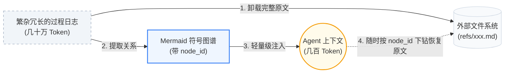

<div align="center">


### 让 Agent 沉淀经验，让人专注创造。


[](https://www.npmjs.com/package/@tencentdb-agent-memory/memory-tencentdb)
[](./LICENSE)
[](https://nodejs.org/)
[](https://github.com/openclaw/openclaw)
[](https://hermes-agent.nousresearch.com/docs/)
[](https://discord.gg/kDtHb5RW2)

[效果亮点](#-效果亮点) · [项目简介](#项目简介) · [核心技术](#核心技术拒绝平铺走向分层与符号化) · [方案特点](#-方案特点) · [快速开始](#快速开始)

<div align="center">

[English](./README.md) · [**简体中文**](./README_CN.md)

</div>

---

</div>

## ✨ 效果亮点

> **TencentDB Agent Memory = 符号化短期记忆 + 分层式长期记忆。**
>
> - **符号化短期记忆**：将厚重的工具日志分层卸载，逐步总结成轻量级 Mermaid 结构符号，大幅降低 Token 消耗的同时提升任务成功率。
> - **分层式长期记忆**：把碎片化对话层层提炼，沉淀出有层次的画像与场景，不再是扁平的向量堆砌。

**作为 OpenClaw 插件接入后**：最高节省 **61.38% Token**，通过率相对提升 **51.52%**；PersonaMem 准确率从 **48%** 提升到 **76%**。

| 记忆能力 | Benchmark | OpenClaw 成功率 | 加插件后成功率 | 相对变化 | OpenClaw Token 消耗 | 加插件后 Token 消耗 | 相对变化 |
| :------ | :--- | :---: | :---: | :---: | :---: | :---: | :---: |
| **短期记忆** | WideSearch | 33% | **50%** | **+51.52%** | 221.31M | **85.64M** | **−61.38%** |
| **短期记忆** | SWE-bench | 58.4% | **64.2%** | **+9.93%** | 3474.1M | **2375.4M** | **−33.09%** |
| **短期记忆** | AA-LCR | 44.0% | **47.5%** | **+7.95%** | 112.0M | **77.3M** | **−30.98%** |
| **长期记忆** | PersonaMem | 48% | **76%** | **+59%** | — | — | — |

> 超长 Session 评测不是单题清空上下文，而是把多个任务拼接到同一个 Session 中连续执行。例如 SWE-bench 每个 Session 连续执行 50 个任务，用来模拟真实长程 Agent 的上下文累积压力。

---

## 项目简介

**Memory 不是为了让 AI 存下所有东西，而是为了让人不必重复所有事情。**

在实际使用中，我们往往需要反复告诉 Agent 固定 SOP、项目背景、工具习惯和输出格式。这些信息不应该每次重新解释，但同时也不应该被无脑、扁平地全部塞进上下文。

TencentDB Agent Memory 帮助 Agent 学会你的流程、保留任务上下文、复用历史经验。但我们**拒绝暴力的历史堆砌**，也**抛弃不可逆的暴力摘要**。我们将记忆设计为一套极具层次感的系统，以**符号化记忆**解决单次长任务的信息过载，以**记忆分层**解决跨会话的经验沉淀。

> **让 Agent 记住该记的，让人把注意力留给判断、创造和真正有价值的工作。**
<p align="center">


  <br/>
  <sub>📱 扫码加入 <b>Agent Memory 微信社群</b>，与早期开发者直接对话</sub>
</p>


## 核心技术：拒绝平铺，走向分层与符号化

TencentDB Agent Memory 的设计理念围绕两个核心展开：**记忆分层** 与 **符号化记忆**。这不仅让 Agent “记得更多”，更重要的是“想得更清”。

### 1. 记忆分层：渐进式披露与异构存储

传统的记忆系统往往将所有数据切片并平铺为向量，召回时如同在一堆毫无关联的便利贴中寻找线索，缺乏宏观视角的指引。

我们认为，**不管是长期的知识、短期的任务，还是未来的经验能力，记忆都不应该平铺，生成和召回都必须有层次**。TencentDB Agent Memory 将“分层”作为整个架构的统一设计哲学：

*   **短期记忆（上下文卸载/任务）的分层**：底层保留原始、厚重的工具调用结果（`refs/*.md`），中层抽取步骤摘要（`jsonl`），高层则浓缩为一张极度轻量的 Mermaid 任务画布。Agent 在上下文中仅需关注高层结构，遇错时再沿着 `node_id` 下钻到底层查证。
*   **长期个性化（用户理解）的分层**：打破扁平的历史记录，建立 **L0 Conversation**（原始对话） → **L1 Atom**（结构化事实） → **L2 Scenario**（场景块） → **L3 Persona**（用户画像）的语义金字塔。平时靠高层 Persona 把握用户偏好，需要考证细节时再检索底层 Atom。
*   **技能生成（Skill与动作沉淀，Roadmap）的分层**：记忆不应仅限于“知道什么”，还应包括“会做什么”。我们正在将分层延伸至动作域：从底层的执行轨迹（Traces）与报错日志中，中层归纳出共性的解决模式，高层最终提炼出可直接挂载复用的 Skill 或标准 SOP 代码。

<p align="center">
  
</p>

**渐进式披露与异构存储**：为了支撑这种无处不在的分层，我们设计了底层数据库与上层文件系统结合的存储方案。底层（海量事实、日志、轨迹）存入数据库或归档文件，确保稳定与全量检索；高层（画像、场景、画布、Skill）存入业务可读的文件系统（Markdown），确保高信息密度、逻辑清晰与白盒可调。**低层保留证据，高层保留结构。**

**每一条信息都 100% 可找回、可恢复**：压缩或抽象最大的风险是“丢失证据”。得益于严格的索引映射机制，系统内没有任何一段摘要是“不可逆”的黑盒。无论是短期记忆中被卸载的一段报错日志，还是长期记忆里总结出的一条用户偏好，Agent 或开发者都可以沿着“高层符号（Persona / 画布） → 中层索引（Scenario / JSONL） → 底层原文（L0 Conversation / refs）”的链路进行完美溯源与恢复。

<div align="center">
  
</div>

### 2. 符号化记忆：用最少符号表达最多语义（Mermaid 画布）

长程任务中最消耗 Token 的往往是繁杂的过程日志（如搜索结果、代码、报错）。为此，我们结合 **上下文卸载 (Context Offloading)** 提出了 **符号化记忆**：

*   **Mermaid 符号图谱**：取代冗长的自然语言或扁平的 JSON，我们使用高密度、强拓扑的 Mermaid 语法来描绘任务状态流转，既能被 LLM 精准理解，也方便人类阅览。
*   **历史折叠与卸载**：完整工具日志被卸载到外部文件系统，上下文仅保留轻量级的 Mermaid 任务地图。
*   **基于 `node_id` 的溯源**：Agent 看着符号图谱推理，如需核对细节，直接 grep 图谱上的 `node_id` 即可瞬间找回完整原文，既大幅降本又保全了 100% 可追溯性。


---

## 快速开始
## 🎬 Demos

<table align="center">
  <tr align="center" valign="middle">
    <td width="50%" valign="middle">
      <video src="https://github.com/user-attachments/assets/667231cd-1c77-43e5-a662-6123a0073bc4" controls="controls" muted="muted" style="max-width: 100%;"></video>
    </td>
    <td width="50%" valign="middle">
      <video src="https://github.com/user-attachments/assets/6c6a29a6-c8aa-45b2-8258-bebac8f03396" controls="controls" muted="muted" style="max-width: 100%;"></video>
    </td>
  </tr>
  <tr align="center" valign="top">
    <td>
      <em>OpenClaw × Agent Memory</em>
    </td>
    <td>
      <em>Hermes × Agent Memory</em>
    </td>
  </tr>
</table>

---

### 1. OpenClaw
### 1.1 安装插件

```bash
openclaw plugins install @tencentdb-agent-memory/memory-tencentdb
openclaw gateway restart
```

> 升级插件请优先使用 OpenClaw 原生更新命令，该方式可以避免因语义化版本范围导致插件禁用：
> ```bash
> openclaw plugins update @tencentdb-agent-memory/memory-tencentdb
> ```

### 1.2 零配置启用

默认使用本地 `SQLite + sqlite-vec` 后端。

```jsonc
// ~/.openclaw/openclaw.json
{
  "memory-tencentdb": {
    "enabled": true
  }
}
```

启用后，TencentDB Agent Memory 会自动完成对话录制、记忆提取、场景归纳、用户画像生成和下一轮对话前召回。


### 1.3 启用短期记忆压缩（可选，要求版本 ≥ 0.3.4）

```jsonc
{
  "memory-tencentdb": {
    "config": {
      "offload": {
        "enabled": true
      }
    }
  }
}
```

#### 步骤 1 —— 在插件配置中注册 slot

在 `slots` 字段中声明 `contextEngine`，让 OpenClaw 把上下文卸载请求路由到本插件：

```jsonc
{
  "plugins": {
    "slots": {
      "contextEngine": "memory-tencentdb"
    }
  }
}
```

#### 步骤 2 —— 执行 patch 脚本

为保证最佳效果，请执行以下 patch 脚本。该脚本会注入 `after-tool-call` 消息钩子，让工具调用结果能被正确卸载与回溯：

```bash
bash scripts/openclaw-after-tool-call-messages.patch.sh
```

> 💡 patch 每次 OpenClaw 安装只需执行一次。升级 OpenClaw 后建议重新执行以确保钩子生效。


### 2. Hermes

除 OpenClaw 外，本插件同样支持 [Hermes](https://github.com/NousResearch/hermes-agent) Agent。根据部署场景选择安装路径：

| 你的场景 | 走哪条路 |
|---|---|
| 想从零启动一个带记忆能力的 Hermes（一条命令搞定） | 2.A Docker（下文） |
| 已经装好了Hermes，只想加上记忆能力 | 2.B 挂到已有 Hermes 上（再下文） |

#### 2.A Docker（全新部署，需版本号 ≥ 0.3.4）

Docker 镜像把 `hermes-agent` 和 `memory_tencentdb` provider 聚合在一起，Gateway 监听 `:8420`：

```bash
# ============ 配置参数说明 ============
# MODEL_API_KEY    大模型 API Key（必填）—— 替换为你自己的凭证
# MODEL_BASE_URL   大模型接入地址，默认指向腾讯云大模型知识引擎（LKE）
# MODEL_NAME       模型名称，默认使用 DeepSeek-V3.2
# MODEL_PROVIDER   服务商类型："custom" 适用于所有 OpenAI 兼容接口

MODEL_API_KEY="your-api-key"
MODEL_BASE_URL="https://api.lkeap.cloud.tencent.com/v1"
MODEL_NAME="deepseek-v3.2"
MODEL_PROVIDER="custom"

# ============ docker run 参数说明 ============
# -d                          后台（detached）模式运行容器
# --name hermes-memory        容器命名，方便后续 docker exec / logs / stop
# --restart unless-stopped    崩溃或宿主机重启时自动拉起
# -p 8420:8420                宿主机端口 ↔ 容器端口（Hermes Gateway）
# -e MODEL_*                  将上方配置参数注入容器环境变量
# -v hermes_data:/opt/data    记忆数据持久化到命名卷（容器重启后数据不丢）

# 进入 Docker 构建目录（已 clone 仓库并位于仓库根目录）
cd docker/opensource

# 构建
docker build -f Dockerfile.hermes -t hermes-memory .

# 运行
docker run -d \
  --name hermes-memory \
  --restart unless-stopped \
  -p 8420:8420 \
  -e MODEL_API_KEY="your-api-key" \
  -e MODEL_BASE_URL="https://api.lkeap.cloud.tencent.com/v1" \
  -e MODEL_NAME="deepseek-v3.2" \
  -e MODEL_PROVIDER="custom" \
  -v hermes_data:/opt/data \
  hermes-memory

# 验证 Gateway
curl http://localhost:8420/health

# 进入 Hermes 对话
docker exec -it hermes-memory hermes
```

> 镜像内置了腾讯云 DeepSeek-V3.2 的默认值，如果你使用该模型，`MODEL_BASE_URL`/`MODEL_NAME`/`MODEL_PROVIDER` 可以省略，只传 `MODEL_API_KEY` 即可。

#### 2.B 挂到已有 Hermes 上（无 Docker）

如果宿主机上已经装好了 `hermes-agent`，只想加上记忆能力，**不需要** Docker 镜像。

**1. 下载插件包到统一目录**：

```bash
mkdir -p ~/.memory-tencentdb
TEMP_DIR=$(mktemp -d)
cd "$TEMP_DIR"
npm init -y --silent
npm install @tencentdb-agent-memory/memory-tencentdb@latest --omit=dev
cp -r node_modules/@tencentdb-agent-memory/memory-tencentdb \
      ~/.memory-tencentdb/tdai-memory-openclaw-plugin
rm -rf "$TEMP_DIR"
```

**2. 安装 Gateway 依赖**：

```bash
cd ~/.memory-tencentdb/tdai-memory-openclaw-plugin
npm install --omit=dev
npm install tsx
```

**3. 链接到 Hermes 插件目录**：

```bash
rm -rf ~/.hermes/hermes-agent/plugins/memory/memory_tencentdb
ln -sf ~/.memory-tencentdb/tdai-memory-openclaw-plugin/hermes-plugin/memory/memory_tencentdb \
       ~/.hermes/hermes-agent/plugins/memory/memory_tencentdb
```

> 此处目录名必须是 **`memory_tencentdb`**（下划线）—— Hermes 用它作为 provider key。`memory-tencentdb`（连字符）只是配置层面的别名，**不**能作为目录名。

**4. 在 `~/.hermes/config.yaml` 中声明 provider**：

```yaml
memory:
  provider: memory_tencentdb
```

**5. 配置 Gateway 环境变量**

编辑 `~/.hermes/.env`，添加：

```bash
MEMORY_TENCENTDB_GATEWAY_CMD="sh -c 'cd ~/.memory-tencentdb/tdai-memory-openclaw-plugin && exec npx tsx src/gateway/server.ts'"
MEMORY_TENCENTDB_GATEWAY_HOST="127.0.0.1"
MEMORY_TENCENTDB_GATEWAY_PORT="8420"
```

LLM 凭证请按需添加（Gateway 实际读取的是 `TDAI_LLM_*` 系列变量）：

```bash
TDAI_LLM_API_KEY="sk-your-api-key-here"
TDAI_LLM_BASE_URL="https://api.openai.com/v1"
TDAI_LLM_MODEL="gpt-4o"
```

也可改用 Gateway 配置文件 `~/.memory-tencentdb/memory-tdai/tdai-gateway.json`：

```json
{
  "llm": {
    "baseUrl": "https://your-api-endpoint/v1",
    "apiKey": "your-api-key",
    "model": "your-model-name"
  }
}
```

**6. 启动 Gateway**（两种方式任选其一）：

- **对话时自动发现（推荐，零配置）**：不启动 Gateway，直接开始和 Hermes 对话。provider 会在第一条对话时自动检测到 `~/.memory-tencentdb/tdai-memory-openclaw-plugin/src/gateway/server.ts` 并以 `Popen()` 拉起。首次对话会略有延迟。
- **手动运行**：提前启动一个独立的 Gateway 进程：
  ```bash
  cd ~/.memory-tencentdb/tdai-memory-openclaw-plugin
  npx tsx src/gateway/server.ts
  ```

**7. 验证**：

```bash
curl http://127.0.0.1:8420/health
# 应返回 {"status":"ok"} 或 {"status":"degraded"}
```

> Provider 的完整参考（环境变量、故障排查、LLM 工具 schema、supervisor 行为）见 [`hermes-plugin/memory/memory_tencentdb/README.md`](./hermes-plugin/memory/memory_tencentdb/README.md)，调整 supervisor / circuit-breaker 默认值之前请先读它。


---

## 🔒 Gateway 安全配置（可选）

Hermes Gateway 监听 `:8420`，对外提供 capture / search / recall 的 HTTP 接口。新增两个开关，可以把它从“开放的本地 sidecar”切换为“需要鉴权的网络服务”。**两个开关默认都关闭，已有部署的行为不变。**

| 字段 | env | 默认值 | 说明 |
| :--- | :--- | :--- | :--- |
| `server.apiKey` | `TDAI_GATEWAY_API_KEY` | _(未设置)_ | 设置后，除 `GET /health` 外的所有接口都要求 `Authorization: Bearer <apiKey>`；缺失或错误的 token 返回 HTTP 401。Token 比较使用常量时间算法，避免时序侧信道。 |
| `server.corsOrigins` | `TDAI_CORS_ORIGINS`（逗号分隔） | `[]` | CORS 白名单。空列表表示**不发送**任何 `Access-Control-Allow-*` 响应头，浏览器同源策略会自动阻止跨域请求。`["*"]` 仅供本地开发，不要用于生产。 |

当 `apiKey` 未设置时，Gateway 启动时会打印一条 `WARN`；如果同时还绑定在非 loopback 地址（例如 `0.0.0.0`），还会再打印一条更醒目的告警。

客户端在启用鉴权后用 Bearer token 调用：

```bash
curl -H "Authorization: Bearer $TDAI_GATEWAY_API_KEY" \
     -H "Content-Type: application/json" \
     -d '{"query":"...","session_key":"..."}' \
     http://127.0.0.1:8420/recall
```

`GET /health` 永远无需 token，方便 `docker healthcheck` / `kubectl liveness` 等编排探针继续工作。

### Hermes 插件侧的配置

Hermes `memory_tencentdb` 插件本身是 Gateway 的**客户端**。当 Gateway 开启了鉴权后，在 Hermes 进程上设置：

```bash
export MEMORY_TENCENTDB_GATEWAY_API_KEY="<与 Gateway 同一份密钥>"
```

插件随后会在每一次发往 Gateway 的请求上附带 `Authorization: Bearer <key>`。该变量未设置时，插件不发送任何鉴权头，与 Gateway 维持开放模式的旧行为完全匹配——已有部署 0 影响。

需要明确的边界：**插件只负责 client 一侧**。Gateway 是否真的强制鉴权由 Gateway 端自己的 `TDAI_GATEWAY_API_KEY` / `server.apiKey` 决定。两端要使用相同的密钥才能匹配；插件不会把这个值传递给 Gateway——因为 Gateway 可能由 Docker、systemd 或其它独立机制拉起，插件没有也不应该去管这个。

若 `MEMORY_TENCENTDB_GATEWAY_API_KEY` 没设置，插件还会回退读取 `TDAI_GATEWAY_API_KEY`，方便两个进程共享同一个 env 文件、只设一个变量名的场景。Gateway 永远不会读 `MEMORY_TENCENTDB_GATEWAY_API_KEY`，那是插件侧专用名字。

---

## 🔧 可调参数

**所有字段均有合理默认值，零配置即可跑。** 如果要调优，可以按使用深度逐层展开。

<details>
<summary><b>🟢 Level 1 · 日常调参</b>（覆盖 90% 使用场景）</summary>

| 字段 | 默认 | 说明 |
| :--- | :--- | :--- |
| `timezone` | `"system"` | 时区：`"system"`（跟随系统）/ IANA 名（`Asia/Shanghai`）/ offset 串（`+08:00`） |
| `storeBackend` | `"sqlite"` | 存储后端：`sqlite` |
| `recall.strategy` | `"hybrid"` | 召回策略：`keyword` / `embedding` / `hybrid`（RRF 融合，推荐） |
| `recall.maxResults` | `5` | 每次召回条数 |
| `recall.maxCharsPerMemory` | `0` | 单条 L1 记忆注入的最大字符数；`0` 表示不限制 |
| `recall.maxTotalRecallChars` | `0` | 每轮 auto-recall 注入的 L1 记忆总字符预算；`0` 表示不限制 |
| `pipeline.everyNConversations` | `5` | 每 N 轮对话触发一次 L1 记忆提取 |
| `extraction.maxMemoriesPerSession` | `20` | 单次 L1 最多提取多少条 |
| `persona.triggerEveryN` | `50` | 每 N 条新记忆触发用户画像生成 |
| `offload.enabled` | `false` | 是否启用短期记忆压缩 |

</details>

<details>
<summary><b>🟡 Level 2 · 进阶调优</b>（长任务 / 长 Session 场景）</summary>

| 字段 | 默认 | 说明 |
| :--- | :--- | :--- |
| `pipeline.enableWarmup` | `true` | Warm-up：新 session 从 1 轮起触发，每次翻倍至 N（1→2→4→…） |
| `pipeline.l1IdleTimeoutSeconds` | `600` | 用户停止对话多久后触发 L1 |
| `pipeline.l2MinIntervalSeconds` | `900` | 同 session 两次 L2 之间的最小间隔 |
| `recall.timeoutMs` | `5000` | 召回超时阈值，超时跳过注入不阻塞对话 |
| `extraction.enableDedup` | `true` | L1 向量去重 / 冲突检测 |
| `capture.excludeAgents` | `[]` | Glob 模式排除特定 Agent（如 `bench-judge-*`） |
| `capture.l0l1RetentionDays` | `0` | L0/L1 本地文件保留天数，`0` = 永不清理 |
| `offload.mildOffloadRatio` | `0.5` | 温和压缩触发比例（占 context window） |
| `offload.aggressiveCompressRatio` | `0.85` | 激进压缩触发比例 |
| `offload.mmdMaxTokenRatio` | `0.2` | MMD 注入 token 预算比例 |
| `bm25.language` | `"zh"` | 分词语言：`zh`（jieba） / `en` |

</details>

<details>
<summary><b>🔴 Level 3 · 完整参数表</b>（运维 / 自定义模型 / 远程 embedding）</summary>

完整字段、类型、约束见 [`openclaw.plugin.json`](./openclaw.plugin.json) 。

- `embedding.*` — 远程 embedding 服务（OpenAI 兼容 API）
  - `embedding.sendDimensions`（默认 `true`）：是否在请求体中携带 `dimensions` 字段。OpenAI `text-embedding-3-*` 系列依赖该字段做 Matryoshka 维度截断；但部分自托管 / 开源模型（如 **BGE-M3**）不支持自定义维度，会以 HTTP 400 报 `does not support matryoshka representation` 拒绝请求。此时请显式设为 `false`，例如：
    ```json
    {
      "embedding": {
        "enabled": true,
        "provider": "openai",
        "baseUrl": "http://your-host:your-port/v1",
        "apiKey": "<KEY>",
        "model": "bge-m3",
        "dimensions": 1024,
        "sendDimensions": false
      }
    }
    ```
- `llm.*` — 独立 LLM 模式（绕过 OpenClaw 内置模型，用指定 API 跑 L1/L2/L3）
- `offload.backendUrl / backendApiKey` — 将 L1/L1.5/L2/L4 offload 流程卸载到后端服务
- `report.*` — 指标上报

</details>

---

## 🤔 方案特点

### 1. 宏观画像 + 微观事实：同一套下钻机制降低幻觉

压缩最大的风险是“省了 Token，也丢了证据”。因此 TencentDB Agent Memory 没有把历史压成一段不可恢复的 summary，而是保留了从高层摘要回到底层证据的路径。

| 问题类型 | 优先使用 | 继续下钻 |
| :--- | :--- | :--- |
| 日常偏好、表达风格、长期目标 | L3 Persona / L2 Scenario | 需要事实时查 L1 Atom / L0 Conversation |
| 具体事实、时间、项目细节 | L1 Atom / L0 Conversation | 命中不足时扩大时间范围或语义检索 |
| 当前长任务继续执行 | Active MMD 任务画布 | 摘要不够时查 JSONL，再读 `refs/*.md` 原文 |
| 历史任务恢复 | Metadata 任务入口 | 打开 MMD → 找 node_id → 追 result_ref |

上层负责“情商”和方向，下层负责“证据”和精度。短期压缩和长期记忆在这里合成一条闭环：**能折叠，也能展开；能抽象，也能追证。**

### 2. 白盒可调试：记忆不是黑盒向量

很多记忆系统的问题是：召回错了，你只能看到一串向量分数，很难判断到底哪里错。TencentDB Agent Memory 把关键中间产物保存在可读文件里：

- L2 Scenario 块是 Markdown，可以直接打开检查。
- L3 Persona 存放在 `persona.md`，可以追溯到对应的 Scenario。
- 短期任务画布是 Mermaid，既能给人看，也能给 Agent 读。
- 原文、摘要、节点之间有 `result_ref` 和 `node_id` 关联。

这意味着调试不再是翻黑盒数据库，而是沿着“Persona → Scenario → Atom → Conversation”的链路逐层定位。

**这些分层记忆产物都存放在 `~/.openclaw/memory-tdai/` 下，可以直接打开目录逐层查看。**

### 3. 工程能力完整：不是 Demo，而是可接入的插件

| 能力 | 说明 |
| :--- | :--- |
| OpenClaw 插件 | 安装后即可自动捕获、提取、召回记忆 |
| Hermes Gateway 适配 | `TdaiCore + HostAdapter` 解耦宿主框架 |
| 本地后端 | `SQLite + sqlite-vec`，开箱即用 |
| 混合检索 | BM25 + 向量 + RRF，兼顾关键词和语义召回 |
| Agent 工具 | `tdai_memory_search` / `tdai_conversation_search` |

---

## 文档

| 文档 | 内容 |
| :--- | :--- |
| [`scripts/README.memory-tencentdb-ctl.md`](./scripts/README.memory-tencentdb-ctl.md) | 运维管理工具说明 |
| [`CHANGELOG.md`](./CHANGELOG.md) | 版本变更记录 |
| [`openclaw.plugin.json`](./openclaw.plugin.json) | OpenClaw 插件声明与配置 Schema |

---
## 社区与贡献

我们欢迎一切形式的贡献——Bug 反馈、功能建议、文档勘误、Benchmark 复现、生态集成，或者一个 Pull Request 都可以。Agent 记忆这件事远未有定论，希望和大家一起把它做出来。

- 🐞 **发现 Bug 或有疑问？** 欢迎到 [GitHub Issues](https://github.com/Tencent/TencentDB-Agent-Memory/issues) 提交，我们会在 24 小时内响应。
- 💡 **有想法想交流？** 欢迎在 [GitHub Discussions](https://github.com/Tencent/TencentDB-Agent-Memory/discussions) 发起讨论。
- 🛠️ **想贡献代码？** 请先阅读 [CONTRIBUTING.md](./CONTRIBUTING_CN.md)。
- 💬 **想加入交流群？** 扫码加入 **Agent Memory 微信社群**，与早期开发者直接对话。
<p align="center">

---

## Roadmap

- [x] 长期个性化记忆（L0 → L3）
- [x] 短期记忆压缩（Context Offload + Mermaid 画布）
- [x] 可用本地 SQLite 后端与腾讯云向量数据库 TCVDB 后端
- [x] OpenClaw 插件与 Hermes Gateway 适配
- [ ] 记忆可迁移：跨 Agent / 跨框架 / 跨设备的导入导出与热迁移
- [ ] Skill自动生成
- [ ] 可视化调试与记忆观测面板

---

<table>
  <tr>
    <td width="68%">
      <b>如果 TencentDB Agent Memory 对你有所帮助，欢迎为项目点亮 ⭐ 支持。</b><br />
      如果有任何建议，欢迎提出issue讨论。
    </td>
    <td width="32%" align="right">
      
    </td>
  </tr>
</table>

[MIT](./LICENSE) © TencentDB Agent Memory Team
